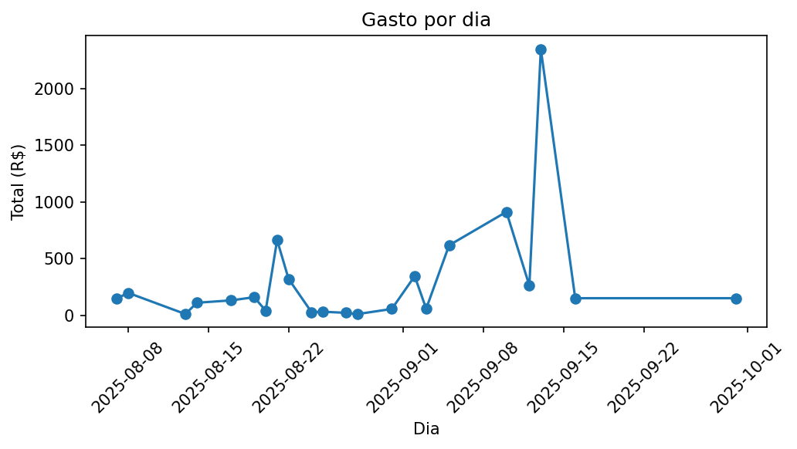
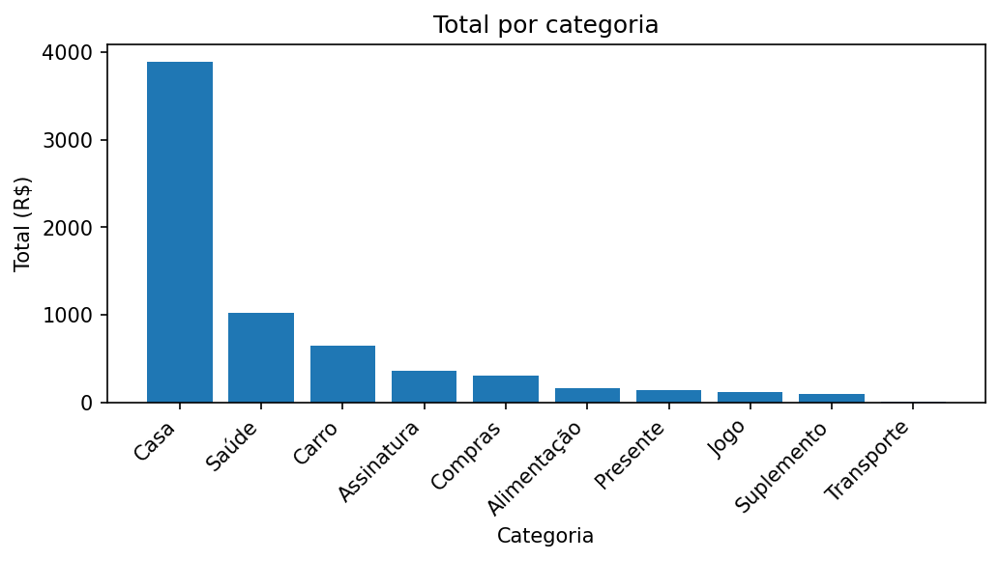
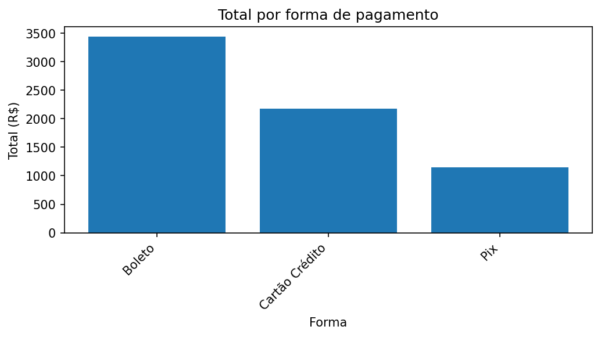
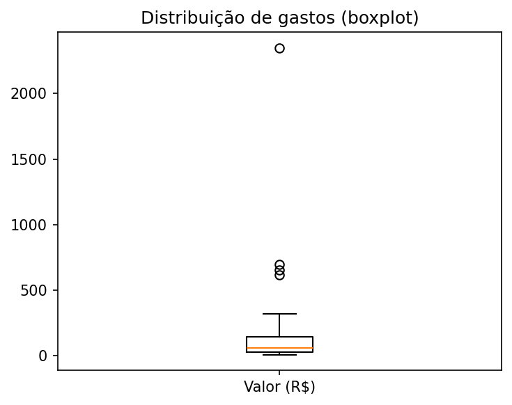

# Relatório de Gastos — Dashboard

## Resumo
- Total gasto: **R$ 6,761.10** em 37 transações.
- Média/Mediana: **R$ 182.73** / **R$ 59.90**.
- Categoria dominante: **Casa** (**R$ 3,890.11**, 57.5% do total).
- Dia com maior gasto: **2025-09-13** (R$ 2,349.53).
- Outliers detectados: **4** (>324.40).

## Gráficos

